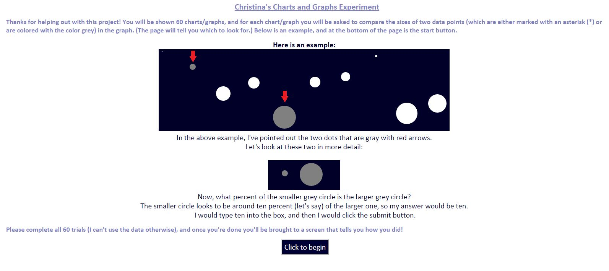
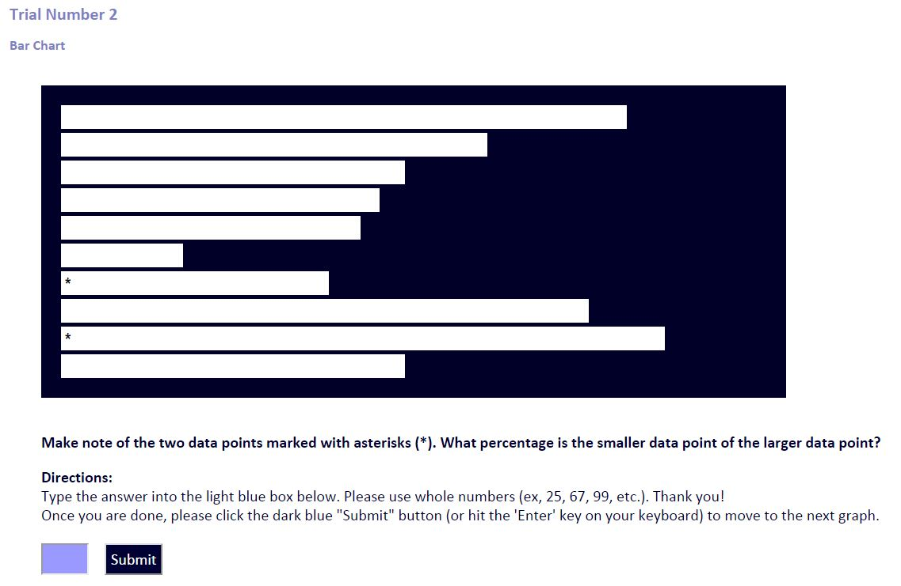
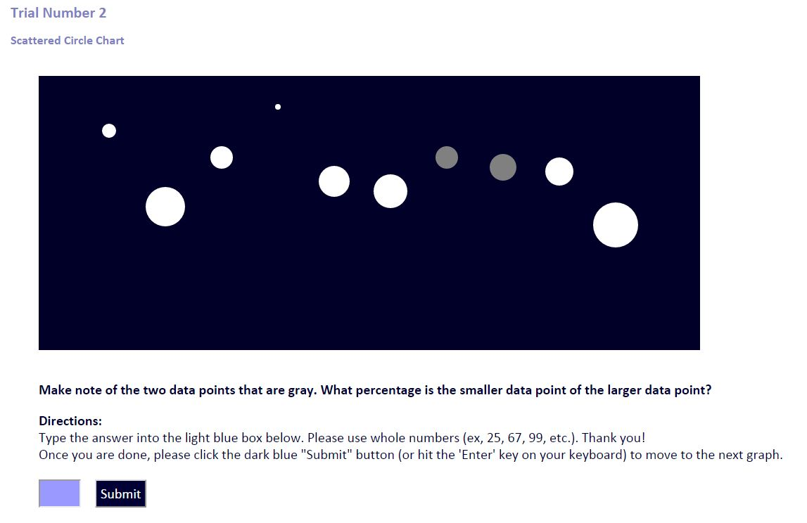
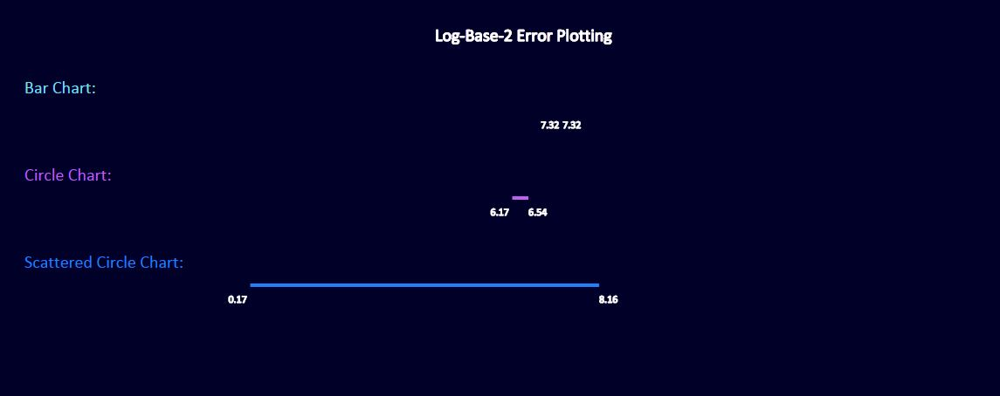
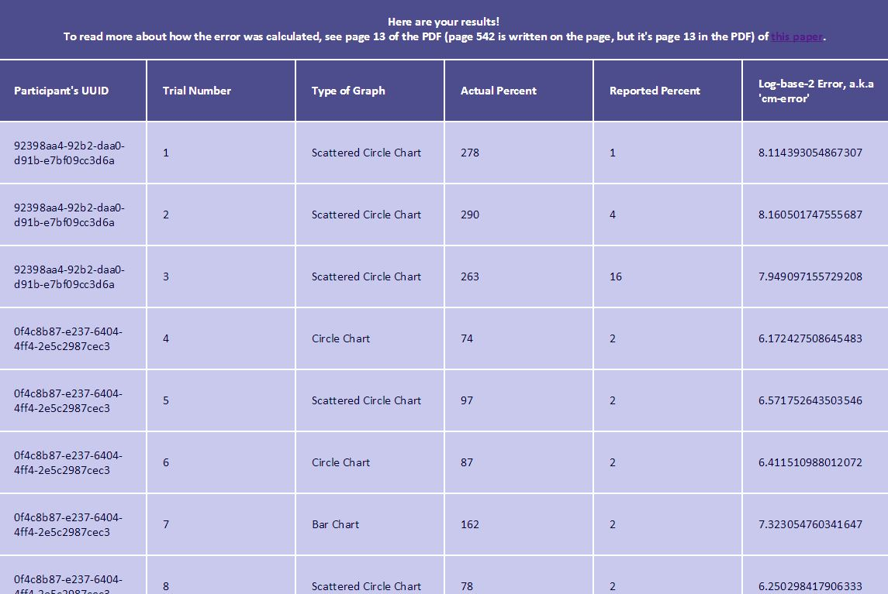
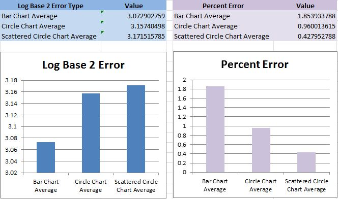

Assignment 5 - Replicating a Classic Experiment
Christina Aiello, cjaiello  
--------------------------

--- Working Link to Visualization ---

["Replicating a Classic Experiment by Christina Aiello"](http://cjaiello.github.io/05-Experiment/index.html)

--- Concise Description and Screenshots ---

This application allows a user 60 opportunities to compare two data points within a set of ten randomly-generated data points. There are three types of visualizations: bar charts, what I've called "circle charts," and what I've called "scattered circle charts." (See screenshots below.) The beginning screen has directions for the user. The next 60 screens show a randomly-chosen chart type with random data values and two randomly-chosen data points for the user to compare. At the end, on the last page the user is shown a table that plots the log-base-2 error ranges for each type of chart (based on the user's trials), and the last page also shows the user the individual results for each trial. When the user has completed all 60 trials and gets to the ending screen, an email is generated with the data for each trial, and that data is emailed to Christina's WPI email address.

---------------------------------

Beginning Screen:

---------------------------------

Bar Chart:

---------------------------------

Circle Chart:

---------------------------------

Scattered Circle Chart:

---------------------------------

Log Base 2 Error:

---------------------------------

Results Table For User's Trials:

---------------------------------

--- Visualizations Tested and the Results (Best to Worst, Ranked by Average Error) ---

With 60 trials per type of chart, I had to only use 57 of my 60 data points in the 95% confidence interval. I dropped two from the bottom and one from the top.

I included both the average percent error ((abs(actual - perceived)/actual) and the log-base-2 error in my data, however as mentioned in the project description, we should focus on the log-base-2 error.

Surprisingly the two versions of circle charts (the scattered circle chart and the regular one) only slightly underperformed in comparison to the bar chart, according to the log base 2 error. The bar chart had the lowest average log base 2 error (approx 3.07), the next best was the circle chart with an average log base 2 error of approx 3.16, and the scattered circle chart came in last at approx 3.17. 

One hypothesis I wanted to test was having circles in a line versus being scattered, with me expecting scattering to make it harder to compare sizes. Scattering circles did affect users' ability to compare sizes to some degree, but not by much. 

Another hypothesis I wanted to test was how people compared squares/bars and circles. I expected the bars to perform better due to what we've learned in class regarding how people perceive/are able to analyze circles versus rectangles/squares. (And yes, the bars did better than either of the circles!).

To see all data and the calculations I performed on the data (in addition to the charts I made about the data), see /data/data_from_all_trials_with_averages_and_graphs.csv. 
To just see the raw data, see /data/data_from_all_trials.csv.

--- Technical Achievements ---

1. My constructLatinSquareDesign() method randomly arranges the numbers 1-60 in an array. I then created a function that chooses a visualization type based on the number provided. If the number is between 1 and 20, I make a bar chart. If the number is between 21 and 40, I make the circles chart. If the number is between 41 and 60, I made the third visualization type. Finally, I iterate through this array of unique random numbers that range from 1 to 60 (For example: [12, 40, 52, 57, 25, 43, 9, 4, 56, 2, 16, 49, 50, 17, 44, 46, 31, 35, 51, 5, 1, 10, 37, 36, 60, 34, 19, 30, 33, 20, 24, 22, 11, 41, 55, 3, 54, 14, 7, 45, 21, 47, 28, 58, 32, 26, 48, 13, 18, 27, 38, 42, 59, 8, 6, 15, 53, 23, 29, 39]), and I choose the visualization type based on the randomly-chosen unique number in that place. See my constructLatinSquareDesign() function and my pickVizToBuild() function in scripts.js for more information. This guarantees that the user sees 20 of each visualization type, and it shows these visualizations in a random order.

2. I used the app "mandrillapp.com" to have the end page (end.html) of my project, which displays the results to the user, also email me a copy of the results in JSON format.

3. To move trial information (the user's values, the error value, the trial number, etc) from one page to another, I have chosen to store it in the session info (using sessionStorage.setItem() and sessionStorage.getItem()).

4. To generate random numbers for the bar values (random values are generated for every bar chart or other visualization), I wrote the function generateAnyRandomNumbers. This function allows duplicate random numbers.

5. To generate random numbers to select two data points from the visualizations, I wrote the function generateDifferentRandomNumbers. This function does not let two of the same number be chosen (because you can't pick the same bar twice, for example. That's just silly).

6. The continueToNextVisualization function takes in the visualization type, and it scrapes the screen and gets info from the session for additional information (user's entered value, the values of the two data points in the chart), which is put into an array and stored in the session information.

7. The session information (stored in the browser) holds an array for every trial (and its key is "results + TRIALNUMBER").

8. The user also cannot refresh the page to skip trials. Refreshing doesn't change the trial number. The number of trials only resets when you go back to the main screen.

9. The user cannot leave the text box blank, and they also cannot give letters and/or special characters in their answers. I used JavaScript to check if the value was null or if it is not a number (see validateForm() function in scripts.js).

10. Lastly, I made an external stylesheet and an external JavaScript sheet, making my actual HTML pages less clunky.

--- Design Achievements ---

1. For ease of use, the user can either hit the "submit" button or just press "enter" after typing in a number to submit.

2. I also wanted to be sure to display the number of trials that have passed (let's be honest, if they're doing 60 trials, they'll be dying to know how far along they are), so I am updating the header at the top of the page based on the trial number.

3. I chose to compare bar charts with what I've called "circle charts," of which I made two versions (regular circle charts and what I've called "scattered" circle charts). Regarding the bar charts, I'd like to see how they perform generally in comparison to the two circle charts. Regarding the circle charts, there are two versions: One version is arranged in a straight line, and the second version ("scattered circle charts") is arranged in relation to the data (If the data is "10," for example, the cy value is (10 * 2). If the data is 100, the cy value is (100 * 2)). I wanted to see if aligning all of the circles in a straight line would improve the accuracy of the user's answers.

--- References ---

1. I referenced old assignments when doing this, but I also want to credit the individuals whose work I referenced when I originally did those assignments:
Bar Chart Reference: 
http://bost.ocks.org/mike/bar/

2. http://stackoverflow.com/questions/25405359/how-can-i-select-last-child-in-d3-js

3. Creating a GUID:
http://stackoverflow.com/questions/105034/create-guid-uuid-in-javascript

4. Displaying final results in a table: 
http://stackoverflow.com/questions/11958641/print-out-javascript-array-in-table

5. Pie Chart Reference:
http://bl.ocks.org/mbostock/3887235